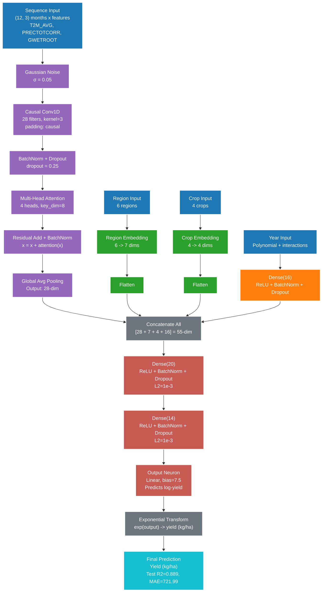

# TCN-MLP Architecture Diagram

## Mermaid Code

## Architecture Details

| Component | Details |
|-----------|---------|
| **TCN Branch** | Causal Conv1D (28 filters) → BatchNorm/Dropout → Multi-Head Attention (4 heads) → GlobalAvgPooling |
| **Categorical** | Region Embedding (6→7) + Crop Embedding (4→4) + Flattening |
| **Trend Branch** | Dense(16) with ReLU + BatchNorm + Dropout |
| **MLP Head** | Dense(20) → Dense(14) → Output(1, linear) |
| **Output Transform** | exp() to convert log-yield to kg/ha |

## Training Configuration

- **Loss Function**: Huber (δ=0.2) - robust to outliers
- **Optimizer**: AdamW (lr=8e-4, weight_decay=2e-4)
- **Regularization**: L2=1e-3, Dropout=0.25
- **Data Augmentation**: Mixup (α=0.3, 40 samples)
- **Dataset**: 510 train / 90 val / 90 test
- **CV**: 5-fold stratified (0.829 ± 0.113 R²)

## Performance

| Metric | Train | Val | Test |
|--------|-------|-----|------|
| **R² Score** | 0.857 | 0.829 | 0.889 |
| **MAE (kg/ha)** | - | 867.91 | 721.99 |
