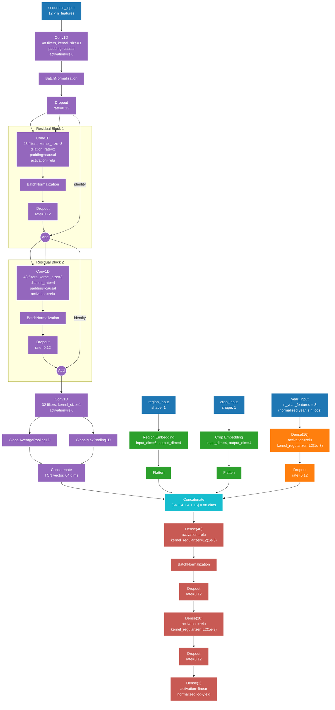

# TCN-MLP Architecture Diagram

## Mermaid Code

```mermaid
graph TD
    %% Inputs
    SI["sequence_input\n12 × n_features"]
    RI["region_input\nshape: 1"]
    CI["crop_input\nshape: 1"]
    YI["year_input\nn_year_features = 3\n(normalized year, sin, cos)"]

    %% TCN Branch
    C1["Conv1D\n48 filters, kernel_size=3\npadding=causal\nactivation=relu"]
    BN1["BatchNormalization"]
    D1["Dropout\nrate=0.12"]

    subgraph Residual_Block_1["Residual Block 1"]
        C_DIL1["Conv1D\n48 filters, kernel_size=3\ndilation_rate=2\npadding=causal\nactivation=relu"]
        BN_DIL1["BatchNormalization"]
        D_DIL1["Dropout\nrate=0.12"]
        ADD1(("Add"))
    end

    subgraph Residual_Block_2["Residual Block 2"]
        C_DIL2["Conv1D\n48 filters, kernel_size=3\ndilation_rate=4\npadding=causal\nactivation=relu"]
        BN_DIL2["BatchNormalization"]
        D_DIL2["Dropout\nrate=0.12"]
        ADD2(("Add"))
    end

    C_FINAL["Conv1D\n32 filters, kernel_size=1\nactivation=relu"]
    GAP["GlobalAveragePooling1D"]
    GMP["GlobalMaxPooling1D"]
    CAT1["Concatenate\nTCN vector: 64 dims"]

    %% Categorical + Year branches
    RE["Region Embedding\ninput_dim=6, output_dim=4"]
    RF["Flatten"]
    CE["Crop Embedding\ninput_dim=4, output_dim=4"]
    CF["Flatten"]
    YB["Dense(16)\nactivation=relu\nkernel_regularizer=L2(1e-3)"]
    YD["Dropout\nrate=0.12"]

    %% Global merger & MLP
    CAT2["Concatenate\n[64 + 4 + 4 + 16] = 88 dims"]
    FC1["Dense(40)\nactivation=relu\nkernel_regularizer=L2(1e-3)"]
    BN2["BatchNormalization"]
    D2["Dropout\nrate=0.12"]
    FC2["Dense(20)\nactivation=relu\nkernel_regularizer=L2(1e-3)"]
    D3["Dropout\nrate=0.12"]
    OUT["Dense(1)\nactivation=linear\nnormalized log-yield"]

    SI --> C1 --> BN1 --> D1 --> C_DIL1
    D1 --> C_DIL1
    C_DIL1 --> BN_DIL1 --> D_DIL1 --> ADD1
    D1 -- identity --> ADD1

    ADD1 --> C_DIL2
    ADD1 --> C_DIL2
    C_DIL2 --> BN_DIL2 --> D_DIL2 --> ADD2
    ADD1 -- identity --> ADD2

    ADD2 --> C_FINAL --> GAP
    C_FINAL --> GMP
    GAP --> CAT1
    GMP --> CAT1

    RI --> RE --> RF
    CI --> CE --> CF
    YI --> YB --> YD

    CAT1 --> CAT2
    RF --> CAT2
    CF --> CAT2
    YD --> CAT2

    CAT2 --> FC1 --> BN2 --> D2 --> FC2 --> D3 --> OUT

    classDef input fill:#1f77b4,stroke:#fff,stroke-width:2px,color:#fff
    classDef tcn fill:#9467bd,stroke:#fff,stroke-width:2px,color:#fff
    classDef categorical fill:#2ca02c,stroke:#fff,stroke-width:2px,color:#fff
    classDef trend fill:#ff7f0e,stroke:#fff,stroke-width:2px,color:#fff
    classDef mlp fill:#c85a54,stroke:#fff,stroke-width:2px,color:#fff
    classDef output fill:#17becf,stroke:#fff,stroke-width:3px,color:#fff

    class SI,RI,CI,YI input
    class C1,BN1,D1,C_DIL1,BN_DIL1,D_DIL1,ADD1,C_DIL2,BN_DIL2,D_DIL2,ADD2,C_FINAL,GAP,GMP,CAT1 tcn
    class RE,RF,CE,CF categorical
    class YB,YD trend
    class FC1,BN2,D2,FC2,D3,OUT mlp
    class CAT2 output
```

## Architecture Details

| Component | Details |
|-----------|---------|
| **TCN Branch** | Conv1D (48, causal) → BatchNorm → Dropout → dilated Conv1D (48, rate=2) + residual add → dilated Conv1D (48, rate=4) + residual add → Conv1D 1×1 (32) → GlobalAveragePooling1D + GlobalMaxPooling1D |
| **Categorical** | Region Embedding (6→4) + Crop Embedding (4→4), each followed by Flatten |
| **Trend Branch** | Dense(16) with ReLU + Dropout, using normalized year + sin + cos |
| **MLP Head** | Dense(40) → BatchNorm → Dropout → Dense(20) → Dropout → Output(1, linear) |
| **Output Transform** | exp() to convert normalized log-yield back to kg/ha |

## Training Configuration

- **Loss Function**: Huber (δ=0.35)
- **Optimizer**: AdamW (lr=3e-4, weight_decay=3e-4, clipnorm=1.0)
- **Regularization**: L2=1e-3, Dropout=0.12
- **Training**: 5-fold stratified CV by crop-region, epochs=160, batch_size=32

## Notes

- The model denormalizes the predicted log-yield outside the network (per-crop mean/std) and applies exp() to report yield in kg/ha.
- This diagram matches the implementation in `notebooks/tcn_mlp_train.ipynb`.

## Block-by-Block Explanation

### Inputs

- `sequence_input`: this is the main signal stream. For each sample, it holds 12 monthly observations arranged in time order, so the network can learn how climate evolves across a full growing cycle. The TCN branch reads this input directly and extracts short-, medium-, and longer-range temporal patterns.
- `region_input`: this is a categorical context variable for the location or administrative region. It is not treated as a raw number, because region IDs do not have meaningful numeric distance between them. Instead, the model learns a dense embedding so each region gets its own learned representation.
- `crop_input`: this is a categorical context variable for crop type. Different crops respond differently to rainfall, temperature, humidity, and seasonality, so the embedding layer lets the model learn crop-specific behavior instead of forcing one shared pattern.
- `year_input`: this is a compact trend signal made from three values: normalized year, sine of year, and cosine of year. The normalized year captures gradual long-term drift, while the sine/cosine pair gives the model a smooth periodic representation that can help it learn cyclical structure or repeating temporal effects.

### TCN Branch

- `Conv1D 48 filters, kernel_size=3, causal`: this is the first temporal feature extractor. It scans across the monthly sequence with a small kernel, which is useful for learning local patterns like early-season warming, rainfall bursts, or short temperature shifts. Causal padding ensures the convolution only uses current and past months, so the model never sees future information when predicting yield.
- `BatchNormalization` and `Dropout`: batch normalization keeps activations in a stable range, which usually makes optimization smoother and less sensitive to initialization. Dropout then randomly removes a fraction of activations during training, which discourages the network from memorizing the training data and helps it generalize better.
- `Residual Block 1`: this block uses dilation rate 2, which effectively skips one month between convolution samples. That expands the receptive field without increasing the number of parameters very much. The residual add is important because it allows the block to learn a correction to the incoming signal instead of replacing it entirely. If the dilated features are useful, they are added on top of the original representation; if not, the shortcut helps preserve the base signal.
- `Residual Block 2`: this block uses dilation rate 4, so it can connect information across a wider span of months. That is useful for seasonal effects that unfold more slowly, such as delayed rainfall impacts or temperature-driven stress that accumulates over several months. Together, the two residual blocks let the model capture both near-term and longer seasonal dependencies.
- `Conv1D 1×1`: after the residual stack, this layer reduces the feature depth from 48 channels to 32. A 1×1 convolution does not mix time steps; it only mixes channels. In practice, this acts like a learned compression step that keeps the most useful temporal features while making the final pooling stage more compact.
- `GlobalAveragePooling1D` and `GlobalMaxPooling1D`: these layers turn the 12-step temporal feature map into a single fixed-length summary vector. Average pooling captures the overall average seasonal signal across the whole year, while max pooling captures the strongest response at any month. Using both is helpful because some crop responses depend on persistent conditions, while others depend on a single extreme event. The concatenated result becomes a 64-dimensional TCN summary.

### Categorical and Trend Branches

- `Region Embedding`: this layer converts each region ID into a learned 4-dimensional vector. The point of the embedding is not to give the region a physical meaning, but to let the network learn a compact region-specific context vector. Regions that behave similarly during training can end up with nearby embeddings, which helps the model generalize across geographic patterns.
- `Crop Embedding`: this does the same for crop type. A crop embedding lets the model encode differences in sensitivity to temperature, rainfall, humidity, and seasonality without requiring a separate model for each crop.
- `Flatten`: the embedding layers produce small tensor outputs with an explicit embedding dimension. Flatten converts them into plain 4-value vectors so they can be merged with the other branch outputs in the concatenation layer.
- `Dense(16)` for year: this branch turns the 3-value year signal into a richer learned representation. The dense layer can detect whether a particular time period belongs to an increasing or decreasing trend and whether the combination of normalized year plus sinusoidal terms carries predictive information for yield.
- `Dropout` on the year branch: this regularizes the trend path so the model does not over-rely on year as a shortcut. That matters because the year signal should help with broad drift, but it should not overpower the climate sequence or the crop/region context.

### Fusion and MLP Head

- `Concatenate`: this is the main fusion point. It joins four information streams into one vector: the 64-dimensional TCN summary, the 4-dimensional region embedding, the 4-dimensional crop embedding, and the 16-dimensional year branch. The result is an 88-dimensional feature vector that contains both temporal weather information and non-temporal context.
- `Dense(40)`: this is the first major mixing layer after concatenation. Its job is to learn interactions across branches, such as how the same climate sequence may have different implications for different crops or regions. A fairly wide hidden layer here gives the network enough capacity to combine the heterogeneous inputs.
- `BatchNormalization` and `Dropout`: once the branches are fused, normalization helps keep the merged representation stable, and dropout makes the head less likely to memorize spurious combinations in the training set.
- `Dense(20)`: this layer compresses the mixed representation into a smaller latent form. By reducing the width, it forces the model to keep only the most predictive interactions before the final prediction.
- `Dropout`: adds one more regularization step right before the output, which is useful because the last hidden layer is close to the final prediction and can otherwise overfit quickly.
- `Dense(1)`: this is the regression output neuron. A linear activation is used because the model is predicting a continuous target in transformed space, not a probability or class label. The single output value represents normalized log-yield.

### Output Interpretation

- The model output is not the final yield directly. It is a normalized log-yield value, which means the model is trained on a transformed target rather than raw yield values.
- During evaluation, the pipeline first reverses the per-crop normalization and then applies `exp()` to recover yield in kg/ha. This is why the final numbers reported in the results tables are back in the original physical unit.
- Training in log space often helps because yield data can be skewed and can contain large outliers. The log transform makes the distribution smoother and gives the optimizer a more stable prediction target.
- The per-crop normalization step is also important: it means the model learns deviations from each crop's typical yield scale instead of trying to fit all crops to one global numeric range.

### Why This Architecture Works

- The TCN branch captures seasonal climate patterns across the 12 months, which is the core of the problem because crop yield is heavily influenced by how temperature and rainfall evolve through the year.
- The residual blocks let the network go deeper in time without losing the original input signal. That makes the model more expressive while still keeping optimization manageable.
- The embeddings let the model learn region and crop context from data rather than assuming that all regions or crops behave in the same way.
- The year branch adds a long-term drift signal, which is useful when climate or agricultural response changes gradually over the years.
- The MLP head combines all of the above into a final regression prediction, so the network can use both temporal dynamics and static context together.

### Data Flow Summary

1. The monthly climate sequence goes through the TCN stack, where the model learns temporal weather features.
2. Region and crop IDs are converted into learned embeddings.
3. The year signal is transformed into a compact trend representation.
4. All features are concatenated into one vector.
5. The dense head learns interactions among climate, crop, region, and time.
6. The final output predicts normalized log-yield, which is later converted back to kg/ha during evaluation.
